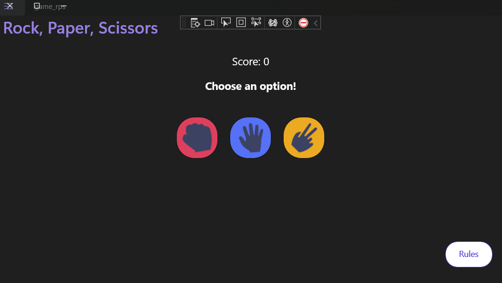
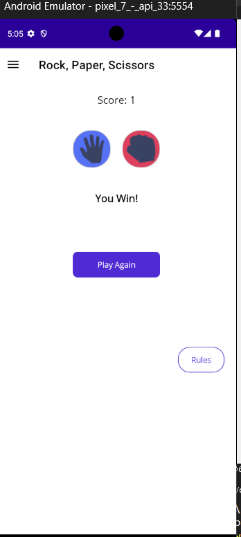

# Rock, Paper, Scissors Game - .NET MAUI

## Overview

A fun little **Rock, Paper, Scissors** game I built using **.NET MAUI**! 🪨📄✂️

I was curious about making a cross-platform app that works on both mobile _and_ desktop. So, I decided to take an old game UI I had built before and reimagine it using **MAUI** — with a bit of help from AI. 😄  
You can check out the previous version of the game UI here: [Old UI](https://asmaa-elfatayry.github.io/Frontend-Mentor-Challenges/advanced/rock-paper-scissors-master/)

This is a simple **Rock-Paper-Scissors** game built using **.NET MAUI** (Multi-platform App UI), designed to be cross-platform and run on **Android**, **iOS**, and **Windows**. The app was created as a fun personal project and a break from my main work in **.NET** development. It showcases the power of **.NET MAUI** for building cross-platform apps that can be used on both mobile devices and laptops.

It’s just a small project I worked on for fun as a break from my serious work, and also to explore app publishing on Windows, Android, and iOS.

## Project Description

The app allows you to play the classic **Rock-Paper-Scissors** game with a randomly chosen opponent. It is developed using **.NET MAUI**, which makes it easy to deploy and run on multiple platforms such as Windows, Android, and iOS. The game provides a simple, easy-to-use interface for players to choose their move and see the outcome of the game.

📱 **Download the Android APK:**
[Click here to download the APK from Google Drive](https://drive.google.com/file/d/1X2QWjbHXUIetnClN910a1HRaRATej859/view?usp=sharing)

## 🛠️ Tech Stack

- .NET MAUI (Multi-platform App UI)
- C# 10
- XAML for UI
- CommunityToolkit.Maui for enhanced features
- Visual Studio 2022

## Features

- Play the Rock-Paper-Scissors game against a random computer opponent.
- Cross-platform support: Android, iOS, and Windows.
- Simple and easy-to-use interface for all devices.
- Basic animations and effects to enhance user experience.

## 📱 Screenshots

### 💻 Desktop View



### 📱 Mobile View

<p align="left">
  
  
</p>

## Installation

To run this app locally, follow the instructions below based on your platform.

### Prerequisites

1. **Install Visual Studio 2022** (or later).
   - Make sure to install the **Mobile development with .NET** workload.
   - For Android/iOS development, you'll need a connected Android device or macOS with Xcode installed.

### Clone the repository

```bash
git clone https://github.com/asmaa-elfatayry/Maui-rock-paper-scissors-game.git
cd maui-rock-paper-scissors
```
